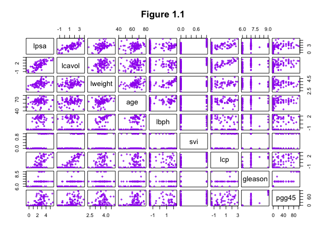

Homework 2
================
Jake Mc Leroth
2025-03-28

Question 2:

``` r
data <- read.csv("/Users/jakemcleroth/Desktop/University/Masters/Modules/Semester 1/SLT/homework/hw_2/prostate.csv", header = FALSE)
colnames(data) <- c("lcavol", "lweight","age", "lbph", "svi", "lcp", "gleason", "pgg45", "lpsa", "train")
data <- data[, c("lpsa", "lcavol", "lweight", "age", "lbph", "svi", "lcp", "gleason", "pgg45", "train")]
```

1)  Here we construct the scatter plot in Figure 1.1:

``` r
pairs(data[,-10],
      pch = 1,
      col = "purple",
      cex = 0.5,
      lwd = 1,
      gap = 0.5,
      main = "Figure 1.1"
)
```

<!-- -->

2)  We repeat example 3.2.1. First we get the correlation matrix of
    predictors as table 3.1:

``` r
row_vars <- c("lweight", "age", "lbph", "svi", "lcp", "gleason", "pgg45")
col_vars <- c("lcavol", "lweight", "age", "lbph", "svi", "lcp", "gleason")
cor_matrix <- cor(data[data[,10] == TRUE, ][, row_vars], data[data[,10] == TRUE,][, col_vars], use = "complete.obs") # only using training data here
print(round(cor_matrix, 3))
```

    ##         lcavol lweight   age   lbph    svi    lcp gleason
    ## lweight  0.300   1.000 0.317  0.437  0.181  0.157   0.024
    ## age      0.286   0.317 1.000  0.287  0.129  0.173   0.366
    ## lbph     0.063   0.437 0.287  1.000 -0.139 -0.089   0.033
    ## svi      0.593   0.181 0.129 -0.139  1.000  0.671   0.307
    ## lcp      0.692   0.157 0.173 -0.089  0.671  1.000   0.476
    ## gleason  0.426   0.024 0.366  0.033  0.307  0.476   1.000
    ## pgg45    0.483   0.074 0.276 -0.030  0.481  0.663   0.757

Looking at the lower triangel, we see that the values mathc those in
table 3.1. We now fit a linear regression model, first splitting scaling
the predictor matrix:

``` r
data <- read.csv("/Users/jakemcleroth/Desktop/University/Masters/Modules/Semester 1/SLT/homework/hw_2/prostate.csv", header = FALSE)
colnames(data) <- c("lcavol", "lweight","age", "lbph", "svi", "lcp", "gleason", "pgg45", "lpsa", "train")
data <- data[, c("lpsa", "lcavol", "lweight", "age", "lbph", "svi", "lcp", "gleason", "pgg45", "train")]
```

``` r
scaled_data <- data
means <- apply((data[,-10]),2,mean)
sds <- apply(data[, -10], 2, sd)

for (i in 2:9) {
  scaled_data[,i] <- (data[,i] - means[i])/sds[i]
}
```

We then split the data:

``` r
std_train_data <- scaled_data[data[,10] == TRUE,][,-10]
std_test_data <- scaled_data[data[,10] == FALSE,][,-10]
```

Here we fit the linear regression and show the parameter values

``` r
model_1 <- lm(lpsa ~ lcavol + lweight + age + lbph + svi + lcp + gleason + pgg45, data = std_train_data)
model_summary_1 <- summary(model_1)
results <- data.frame(
  Coefficient = model_summary_1$coefficients[, "Estimate"],
  Std_Error = model_summary_1$coefficients[, "Std. Error"],
  Z_Score = model_summary_1$coefficients[, "t value"],
  P_Value = model_summary_1$coefficients[, "Pr(>|t|)"]
)

print(round(results,3), row.names = FALSE)
```

    ##  Coefficient Std_Error Z_Score P_Value
    ##        2.465     0.089  27.598   0.000
    ##        0.680     0.127   5.366   0.000
    ##        0.263     0.096   2.751   0.008
    ##       -0.141     0.101  -1.396   0.168
    ##        0.210     0.102   2.056   0.044
    ##        0.305     0.124   2.469   0.017
    ##       -0.288     0.155  -1.867   0.067
    ##       -0.021     0.145  -0.147   0.884
    ##        0.267     0.154   1.738   0.088

We see these are identical to Table 3.2.

3)  To obtain the F statistic on pg 51, we must refit the model without
    the insignficant parameters (age, lcp, gleason and pgg45)

``` r
reduced_model <- lm(lpsa ~ lcavol + lweight + lbph + svi, data = std_train_data)

test_result <- anova(reduced_model, model_1)
f_statistic <- test_result$F[2]
p_value <- test_result$`Pr(>F)`[2]
df_num <- test_result$Df[2]  
df_den <- df.residual(model_1) 

exclusion_test <- data.frame(
  Test = "Partial F-test",
  F_statistic = f_statistic,
  df_num = df_num,
  df_den = df_den,
  p_value = p_value
)

print(exclusion_test)
```

    ##             Test F_statistic df_num df_den   p_value
    ## 1 Partial F-test    1.669751      4     58 0.1693381

We see here this matches the value and p-value on pg51. Here we show the
absolute mean error:

``` r
y_pred <- predict(model_1, newdata = std_test_data)
y_test <- std_test_data$lpsa

prediction_errors <- (y_test - y_pred)^2
mean_prediction_error <- mean(prediction_errors)
print(mean_prediction_error)
```

    ## [1] 0.5212727

Which is the same as on page 51.

4)  Here, additionally do the Ridge, Lasso and best subset selection

``` r
library(glmnet)
```

    ## Loading required package: Matrix

    ## Loaded glmnet 4.1-8

Column 4 of table 3.3:

``` r
X <- as.matrix(std_train_data[, c("lcavol", "lweight", "age", "lbph", "svi", "lcp", "gleason", "pgg45")])
y <- std_train_data$lpsa

# Ridge regression (alpha = 0)
ridge_model <- glmnet(X, y, alpha = 0)

cv_ridge <- cv.glmnet(X, y, alpha = 0, nfolds = 10)
best_lambda_ridge <- cv_ridge$lambda.min
ridge_final <- glmnet(X, y, alpha = 0, lambda = best_lambda_ridge)
print(coef(ridge_final))
```

    ## 9 x 1 sparse Matrix of class "dgCMatrix"
    ##                      s0
    ## (Intercept)  2.46699458
    ## lcavol       0.58066690
    ## lweight      0.25755675
    ## age         -0.11030162
    ## lbph         0.20017563
    ## svi          0.28132984
    ## lcp         -0.16317827
    ## gleason      0.01242085
    ## pgg45        0.19963552

``` r
ridge_coef <- coef(ridge_final)

X_test <- as.matrix(std_test_data[, c("lcavol", "lweight", "age", "lbph", "svi", "lcp", "gleason", "pgg45")])
y_test <- std_test_data$lpsa
ridge_preds <- predict(ridge_final, newx = X_test)
ridge_mse <- mean((y_test - ridge_preds)^2)
print(paste("Ridge MSE:", ridge_mse))
```

    ## [1] "Ridge MSE: 0.494384263972173"

Column 5 of table table 3.3

``` r
# Lasso regression (alpha = 1)
lasso_model <- glmnet(X, y, alpha = 1)

# Cross-validation for best lambda
cv_lasso <- cv.glmnet(X, y, alpha = 1, nfolds = 10)
best_lambda_lasso <- cv_lasso$lambda.min

# Fit Lasso with best lambda
lasso_final <- glmnet(X, y, alpha = 1, lambda = best_lambda_lasso)
print(coef(lasso_final))
```

    ## 9 x 1 sparse Matrix of class "dgCMatrix"
    ##                     s0
    ## (Intercept)  2.4671488
    ## lcavol       0.6297368
    ## lweight      0.2520773
    ## age         -0.1009566
    ## lbph         0.1911140
    ## svi          0.2672645
    ## lcp         -0.1753807
    ## gleason      .        
    ## pgg45        0.1940466

``` r
lasso_coefs <- coef(lasso_final)

X_test <- as.matrix(std_test_data[, c("lcavol", "lweight", "age", "lbph", "svi", "lcp", "gleason", "pgg45")])
y_test <- std_test_data$lpsa

lasso_preds <- predict(lasso_final, newx = X_test)
lasso_mse <- mean((y_test - lasso_preds)^2)
print(paste("Lasso MSE:", lasso_mse))
```

    ## [1] "Lasso MSE: 0.486785204332903"

For best sub set selection, we keep removing the the least significant
variable until they are all significant:

``` r
model <- lm(lpsa ~ lcavol + lweight + age + lbph + svi + lcp  + pgg45, data = std_train_data)
model_summary <- summary(model)
results <- data.frame(
  Coefficient = model_summary$coefficients[, "Estimate"],
  Std_Error = model_summary$coefficients[, "Std. Error"],
  Z_Score = model_summary$coefficients[, "t value"],
  P_Value = model_summary$coefficients[, "Pr(>|t|)"]
)

print(round(results,3), row.names = FALSE)
```

    ##  Coefficient Std_Error Z_Score P_Value
    ##        2.467     0.088  28.161   0.000
    ##        0.676     0.124   5.462   0.000
    ##        0.265     0.094   2.833   0.006
    ##       -0.145     0.098  -1.486   0.142
    ##        0.210     0.101   2.069   0.043
    ##        0.307     0.122   2.519   0.014
    ##       -0.287     0.153  -1.877   0.065
    ##        0.252     0.116   2.182   0.033

Now remove age:

``` r
model <- lm(lpsa ~ lcavol + lweight + lbph + svi + lcp + pgg45, data = std_train_data)
model_summary <- summary(model)
results <- data.frame(
  Coefficient = model_summary$coefficients[, "Estimate"],
  Std_Error = model_summary$coefficients[, "Std. Error"],
  Z_Score = model_summary$coefficients[, "t value"],
  P_Value = model_summary$coefficients[, "Pr(>|t|)"]
)

print(round(results,3), row.names = FALSE)
```

    ##  Coefficient Std_Error Z_Score P_Value
    ##        2.451     0.088  27.907   0.000
    ##        0.648     0.124   5.244   0.000
    ##        0.241     0.093   2.590   0.012
    ##        0.183     0.101   1.816   0.074
    ##        0.313     0.123   2.545   0.014
    ##       -0.267     0.154  -1.734   0.088
    ##        0.213     0.114   1.872   0.066

Now remove lcp

``` r
model <- lm(lpsa ~ lcavol + lweight + lbph + svi + pgg45, data = std_train_data)
model_summary <- summary(model)
results <- data.frame(
  Coefficient = model_summary$coefficients[, "Estimate"],
  Std_Error = model_summary$coefficients[, "Std. Error"],
  Z_Score = model_summary$coefficients[, "t value"],
  P_Value = model_summary$coefficients[, "Pr(>|t|)"]
)

print(round(results,3), row.names = FALSE)
```

    ##  Coefficient Std_Error Z_Score P_Value
    ##        2.463     0.089  27.667   0.000
    ##        0.557     0.114   4.900   0.000
    ##        0.242     0.095   2.552   0.013
    ##        0.199     0.102   1.953   0.055
    ##        0.239     0.117   2.040   0.046
    ##        0.122     0.103   1.191   0.238

Now remove pgg45

``` r
model <- lm(lpsa ~ lcavol + lweight + lbph + svi, data = std_train_data)
model_summary <- summary(model)
results <- data.frame(
  Coefficient = model_summary$coefficients[, "Estimate"],
  Std_Error = model_summary$coefficients[, "Std. Error"],
  Z_Score = model_summary$coefficients[, "t value"],
  P_Value = model_summary$coefficients[, "Pr(>|t|)"]
)

print(round(results,3), row.names = FALSE)
```

    ##  Coefficient Std_Error Z_Score P_Value
    ##        2.471     0.089  27.766   0.000
    ##        0.596     0.109   5.461   0.000
    ##        0.231     0.095   2.441   0.018
    ##        0.203     0.102   1.988   0.051
    ##        0.278     0.113   2.459   0.017

Now remove lbph

``` r
model <- lm(lpsa ~ lcavol + lweight + svi, data = std_train_data)
model_summary <- summary(model)
results <- data.frame(
  Coefficient = model_summary$coefficients[, "Estimate"],
  Std_Error = model_summary$coefficients[, "Std. Error"],
  Z_Score = model_summary$coefficients[, "t value"],
  P_Value = model_summary$coefficients[, "Pr(>|t|)"]
)

print(round(results,3), row.names = FALSE)
```

    ##  Coefficient Std_Error Z_Score P_Value
    ##        2.469     0.091  27.117   0.000
    ##        0.613     0.111   5.507   0.000
    ##        0.316     0.086   3.656   0.001
    ##        0.223     0.112   1.985   0.051

Now remove svi (column 3 of table 3.3)

``` r
model_best_subset <- lm(lpsa ~ lcavol + lweight, data = std_train_data)
model_summary_best_subset <- summary(model_best_subset)
results <- data.frame(
  Coefficient = model_summary_best_subset$coefficients[, "Estimate"],
  Std_Error = model_summary_best_subset$coefficients[, "Std. Error"],
  Z_Score = model_summary_best_subset$coefficients[, "t value"],
  P_Value = model_summary_best_subset$coefficients[, "Pr(>|t|)"]
)

print(round(results,3), row.names = FALSE)
```

    ##  Coefficient Std_Error Z_Score P_Value
    ##        2.477     0.093  26.625   0.000
    ##        0.740     0.093   7.938   0.000
    ##        0.316     0.088   3.582   0.001

``` r
y_pred_best_subset <- predict(model_best_subset, newdata = std_test_data)
y_test <- std_test_data$lpsa
prediction_errors <- (y_test - y_pred_best_subset)^2
mean_prediction_error_best_subset <- mean(prediction_errors)
print(paste("Best Subset MSE:", mean_prediction_error_best_subset))
```

    ## [1] "Best Subset MSE: 0.492480383663165"

Column 2 was obtain earlier when we fitted the linear regression.

This is now the best subset. The prediction errors of the models:

``` r
# best subset
y_pred_best_subset <- predict(model_best_subset, newdata = std_test_data)
y_test <- std_test_data$lpsa
prediction_errors <- (y_test - y_pred_best_subset)^2
mean_prediction_error_best_subset <- mean(prediction_errors)
print(paste("Best Subset MSE:", mean_prediction_error_best_subset))
```

    ## [1] "Best Subset MSE: 0.492480383663165"

``` r
print(paste("LS MSE:", mean_prediction_error))
```

    ## [1] "LS MSE: 0.521272734322784"
