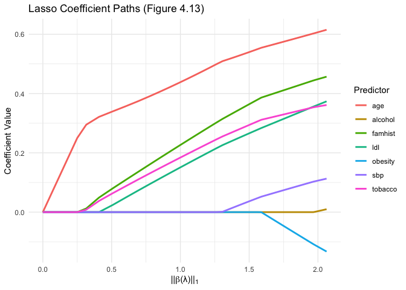

Homework 3
================
Jake Mc Leroth
2025-03-28

Question 2:

``` r
heart_data <- read.csv("/Users/jakemcleroth/Desktop/University/Masters/Modules/Semester 1/SLT/homework/hw_3/SAheart.csv")
heart_data <- heart_data[,c("chd","sbp", "tobacco", "ldl", "famhist", "obesity", "alcohol", "age")]
```

1)  Exploratory Analysis

``` r
colSums(is.na(heart_data))
```

    ##     chd     sbp tobacco     ldl famhist obesity alcohol     age 
    ##       0       0       0       0       0       0       0       0

We see that the data set has no missing values.

Now we look at some visual plots of some descriptive statistics of each
variable

``` r
# Histograms
par(mfrow = c(2, 3))  # Set up 2x3 plot grid
for (col in c("sbp", "tobacco", "ldl", "obesity", "alcohol", "age")) {
  hist(heart_data[[col]], main = paste("Histogram of", col), xlab = col, col = "skyblue")
}
```

<!-- -->

``` r
# Boxplots
par(mfrow = c(2, 3))
for (col in c("sbp", "tobacco", "ldl", "obesity", "alcohol", "age")) {
  boxplot(heart_data[[col]], main = paste("Boxplot of", col), col = "lightgreen")
}
```

<!-- -->
From the boxplots, we first not that all predictors axcept age have
outliers. Again, all the data is quite skewed except for age (expected
since the study was from ages 15-54). Looking at the histograms, we see
the shape between alcohol and tobacco is quite similar. Obesity has a
skewed bell curve. We note that ages 20-25 seem to be underrepresented
in the sample. We now look at family history of heat disease:

``` r
barplot(table(heart_data$famhist), 
        main = "Family History of Heart Disease",
        names.arg = c("Absent", "Present"),
        col = c("lightblue", "salmon"))
```

<!-- -->
This class is fairly balanced.

2)  Using red dots for cases of heart disease, and turqoise for not, we
    plot the scatter plot for all the predictor variables:

``` r
numeric_heart_data <- heart_data[,-1]
numeric_heart_data$famhist <- ifelse(heart_data$famhist == "Present", 1, 0)

light_red <- "#FF9999" # Heart disease
turquoise_blue <- "#40E0D0" # No heart disease

point_colors <- ifelse(heart_data[,1] == 1, light_red, turquoise_blue)

pairs(numeric_heart_data,
      pch = 1,        
      col = point_colors, 
      cex = 0.5,      
      lwd = 1,      
      gap = 0.7,      
      main = "Figure 4.12"
)
```

<!-- -->

3)  We replicate example 4.4.2. We start by fitting a logistic
    regression to the data:

``` r
log_reg <- glm( chd ~ sbp + tobacco + ldl + famhist + obesity + alcohol + age, family = binomial, data = heart_data)

model_summary <- summary(log_reg)
results <- data.frame(
  Coefficient = model_summary$coefficients[, "Estimate"],
  Std_Error = model_summary$coefficients[, "Std. Error"],
  Z_Score = model_summary$coefficients[, "z value"],  
  P_Value = model_summary$coefficients[, "Pr(>|z|)"]
)

print(round(results, 3), row.names = FALSE)
```

    ##  Coefficient Std_Error Z_Score P_Value
    ##       -4.130     0.964  -4.283   0.000
    ##        0.006     0.006   1.023   0.306
    ##        0.080     0.026   3.034   0.002
    ##        0.185     0.057   3.219   0.001
    ##        0.939     0.225   4.177   0.000
    ##       -0.035     0.029  -1.187   0.235
    ##        0.001     0.004   0.136   0.892
    ##        0.043     0.010   4.181   0.000

We see here that the values match that in table 4.2. We now want to do a
stepwise logistic regression to get the best subset of predictors. We do
this by dropping the least significant predictor and refiting the model,
repeating until all predictors are significant. Alcohol is the least
significant with a p-value of 0.892. We start by removing this for
stepwise logistic regression:

``` r
# remove alchohol
log_reg_2 <- glm( chd ~ sbp + tobacco + ldl + famhist + obesity + age, family = binomial, data = heart_data)

model_summary_2 <- summary(log_reg_2)
results_2 <- data.frame(
  Coefficient = model_summary_2$coefficients[, "Estimate"],
  Std_Error = model_summary_2$coefficients[, "Std. Error"],
  Z_Score = model_summary_2$coefficients[, "z value"],  
  P_Value = model_summary_2$coefficients[, "Pr(>|z|)"]
)

print(round(results_2, 3), row.names = FALSE)
```

    ##  Coefficient Std_Error Z_Score P_Value
    ##       -4.128     0.964  -4.283   0.000
    ##        0.006     0.006   1.050   0.294
    ##        0.080     0.026   3.117   0.002
    ##        0.184     0.057   3.218   0.001
    ##        0.941     0.224   4.196   0.000
    ##       -0.035     0.029  -1.187   0.235
    ##        0.042     0.010   4.187   0.000

Next step we drop sbp:

``` r
# remove sbp
log_reg_3 <- glm( chd ~ tobacco + ldl + famhist + obesity + age, family = binomial, data = heart_data)

model_summary_3 <- summary(log_reg_3)
results_3 <- data.frame(
  Coefficient = model_summary_3$coefficients[, "Estimate"],
  Std_Error = model_summary_3$coefficients[, "Std. Error"],
  Z_Score = model_summary_3$coefficients[, "z value"],  
  P_Value = model_summary_3$coefficients[, "Pr(>|z|)"]
)

print(round(results_3, 3), row.names = FALSE)
```

    ##  Coefficient Std_Error Z_Score P_Value
    ##       -3.547     0.786  -4.511   0.000
    ##        0.081     0.026   3.154   0.002
    ##        0.185     0.057   3.238   0.001
    ##        0.933     0.224   4.169   0.000
    ##       -0.031     0.029  -1.063   0.288
    ##        0.045     0.010   4.630   0.000

Next we drop obesity:

``` r
# remove sbp
log_reg_4 <- glm( chd ~ tobacco + ldl + famhist + age, family = binomial, data = heart_data)

model_summary_4 <- summary(log_reg_4)
results_4 <- data.frame(
  Coefficient = model_summary_4$coefficients[, "Estimate"],
  Std_Error = model_summary_4$coefficients[, "Std. Error"],
  Z_Score = model_summary_4$coefficients[, "z value"],  
  P_Value = model_summary_4$coefficients[, "Pr(>|z|)"]
)

print(round(results_4, 3), row.names = FALSE)
```

    ##  Coefficient Std_Error Z_Score P_Value
    ##       -4.204     0.498  -8.437   0.000
    ##        0.081     0.026   3.163   0.002
    ##        0.168     0.054   3.093   0.002
    ##        0.924     0.223   4.141   0.000
    ##        0.044     0.010   4.521   0.000

We see that all predictors are significant at a 5% significance level.
This is now the best subset of predictors from using stepwise logistic
regression. We note that the output matches table 4.3.

4)  We replicat figure 4.13, which shows the effect of L1 regularisation
    on predictor coefficients.

``` r
library(glmnet)
```

    ## Loading required package: Matrix

    ## Loaded glmnet 4.1-8

``` r
library(ggplot2)
```

To replicate 4.13, we first scale the predictor matrix and fit the lasso
logistic regression:

``` r
X <- as.matrix(numeric_heart_data)  
X <- scale(X)
y <- heart_data[, 1]  

lasso_model <- glmnet(X, y, alpha = 1, family = "binomial") # alpha=1 for L1 regularization
```

We then get. the data we are going to plot:

``` r
coef_matrix <- coef(lasso_model, s = lasso_model$lambda)
coef_matrix <- coef_matrix[-1, ] 
l1_norm <- colSums(abs(coef_matrix))

plot_data <- data.frame(
  Predictor = rep(rownames(coef_matrix), each = ncol(coef_matrix)),
  Lambda = rep(lasso_model$lambda, times = nrow(coef_matrix)),
  L1_Norm = rep(l1_norm, times = nrow(coef_matrix)),
  Coefficient = as.vector(t(coef_matrix))
)
```

Finally, we plot figure 4.13:

``` r
ggplot(plot_data, aes(x = L1_Norm, y = Coefficient, color = Predictor)) +
  geom_line(linewidth = 1) +
  labs(
    x = expression(paste("||", beta, "(λ)||", ""[1])),
    y = "Coefficient Value",
    title = "Lasso Coefficient Paths (Figure 4.13)"
  ) +
  theme_minimal() +
  theme(legend.position = "right")
```

<!-- -->

We see here that the graph matches figure 4.14.

``` r
library(dplyr)
```

    ## 
    ## Attaching package: 'dplyr'

    ## The following objects are masked from 'package:stats':
    ## 
    ##     filter, lag

    ## The following objects are masked from 'package:base':
    ## 
    ##     intersect, setdiff, setequal, union

5)  Here we plot the calibration curve:

``` r
# Get predicted probabilities for each model
heart_data$pred_probs_log_reg <- predict(log_reg, type = "response")
heart_data$pred_probs_log_reg_4 <- predict(log_reg_4, type = "response")
```

``` r
num_bins <- 10

# Compute calibration curve
get_calibration_data <- function(pred_probs, outcome, bins = num_bins) {
  tibble(pred_probs = pred_probs, outcome = outcome) %>%
    mutate(bin = cut(pred_probs, breaks = quantile(pred_probs, probs = seq(0, 1, length.out = bins + 1), na.rm = TRUE), include.lowest = TRUE)) %>%
    group_by(bin) %>%
    summarise(mean_pred = mean(pred_probs, na.rm = TRUE),
              mean_obs = mean(outcome, na.rm = TRUE))
}

calibration_log_reg <- get_calibration_data(heart_data$pred_probs_log_reg, heart_data$chd)
calibration_log_reg_4 <- get_calibration_data(heart_data$pred_probs_log_reg_4, heart_data$chd)
calibration_log_reg$model <- "Full Logistic Regression"
calibration_log_reg_4$model <- "Reduced Logistic Regression"
calibration_data <- bind_rows(calibration_log_reg, calibration_log_reg_4)

ggplot(calibration_data, aes(x = mean_pred, y = mean_obs, color = model)) +
  geom_point() +
  geom_line() +
  geom_abline(slope = 1, intercept = 0, linetype = "dashed", color = "black") + #
  labs(x = "Mean Predicted Probability", y = "Observed Frequency", title = "Calibration Curves") +
  theme_minimal() +
  scale_color_manual(values = c("blue", "red")) 
```

<!-- -->

We see both plots are close to the 45 degree line, meaning they are both
well calibrated. The red line seems to be closer most of the time, and
therefore this is the better model when looking at in-sample data.
